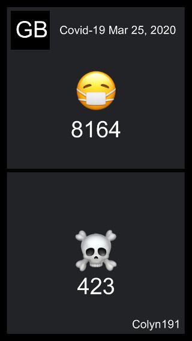
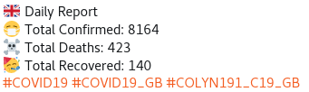

## Colyn191, automatic report about the situation of COVID-19

Colyn191 is an automated robot, her role is inform people about the situation of COVID-19 through social networks. Our data come from the official <a href="https://github.com/CSSEGISandData/COVID-19" target="_blank" >repository</a> of Johns Hopkins University Center for Systems Science and Engineering (JHU CSSE).

- <a href="https://twitter.com/colyn191" target="_blank">Twitter</a>
- <a href="https://github.com/airmelon-studio/colyn191/issues" target="_blank">Any suggestions?</a>

### Message

Once the data has been processed, here is an example of a basic message;

```
Daily Report
Total Confirmed: 509
Total Deaths: 2 
```

#### With recovered

```
Daily Report
Total Confirmed: 509
Total Deaths: 2 
Total Recovered: 152
```

#### With difference with D-1

```
Daily Report
Total Confirmed: 509 (+54)
Total Deaths: 2 
```

### With a story



### With emoji



### Useful links

- <a href="https://corona-status.live" target="_blank">Corona Status</a>
- <a href="https://icebob.info/covid19" target="_blank">COVID-19 Daily Report</a>
- <a href="https://mdusmanansari.github.io/COVID-19-Global-Report" target="_blank">COVID-19 Global Report</a>
- <a href="https://corona.netflex.dev" target="_blank">COVID-19 Stats Worldwide</a>
- <a href="https://github.com/CSSEGISandData/COVID-19" target="_blank">CSSEGISandData</a>

### Changelog

All notable changes to this project will be documented in this section.

### [0.5.0]

### Bug Fixes

* get reliable data for us report
* enable us daily report

### [0.4.0]

### Features

* add feature flag on media service
* add create story method on media service

### Bug Fixes

* disable us daily report for temporarily

### [0.3.2]

### Bug Fixes

* bug fixes and experience improvements

#### [0.3.1] (2020-03-24)

##### Bug Fixes

* add feature flag on recovered peoples of covid19 daily report 
* support country `ad`, `ae`, `al`, `am`, `ar`, `ba`, `bf`, `bg`, `bh`, `bn`, `ck`, `cl`, `co`, `cr`, `cy`, `do`, `dz`, `ec`, `ee`, `eg`, `fi`, `gr`, `hr`, `hu`, `id`, `il`, `in`, `iq`, `is`, `jo`, `kw`, `lb`, `lk`, `lt`, `lu`, `lv`, `ma`, `md`, `mk`, `mt`, `mx`, `pa`, `pe`, `ph`, `pk`, `pl`, `qa`, `ro`, `rs`, `ru`, `sa`, `sg`, `si`, `sk`, `sm`, `th`, `tn`, `tr`, `uy`, `vn`, `za`

#### [0.3.0] (2020-03-24)

##### Features

* support country `br`
* support country `ir`, `fr`, `kr`, `ch`

#### [0.2.0] (2020-03-24)

##### Features

* support country `us`, `gb`, `nl`, `be`, `at`, `no`, `se`, `pt`, `dk`, `ca`, `au`, `my`, `br`, `jp`, `cz`

#### 0.1.0 (2020-03-24)

##### Features

* add diff on daily report
* add emoji on daily report
* add translation for each country
* add support of twitter service
* allow to import data on a specific date
* import covid19 data every 4 hours
* report daily covid19 for `es`, `de`
* publish daily report every day at 2 o'clock

#### Bug Fixes

* add breakline on report format
* update daily report format
* add support of top 23 countries with confirmed cases of covid-19
* add user dedicated hashtag
* fix edge case on company, state and report import
* do not send daily report if source give a 404
* avoid duplicate report
* display chart only if ratio is greater than 5%
* support latest version of timeseries
* support legacy active property of CSSEGISandData

### Support or Contact

Having trouble with the robot? You can contact the <a href="https://github.com/arnaud-zg" target="_blank">maintainer</a>.
